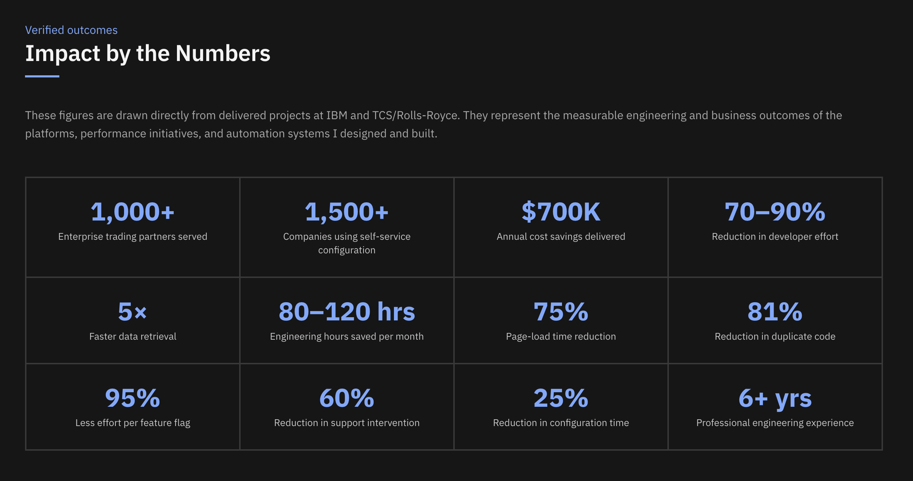

# 👋 Hi, I'm Pradeep Reddy

### Lead Software Engineer | Full-Stack | AI Engineering

Lead Software Engineer at **IBM** with **6+ years of experience** building scalable enterprise products, developer platforms, and AI-powered workflows.

---

### 🛠️ Core Stack

**AI engineering:** LLMs · Prompt Engineering · RAG · AI Agents · Tool Use · Evaluation · Guardrails · watsonx Orchestrate  
**Languages:** Java · Python · TypeScript · JavaScript · SQL  
**Frontend:** Angular · React  
**Backend:** Spring Boot · Flask · Django · REST APIs · Microservices  
**Engineering:** System Design · Software Architecture · Docker · Kubernetes · CI/CD  

---

### 🚀 Selected Impact

- 🤖 AI-Enabled Certificate Management Workflow Orchestration serving **2,500+ enterprise partners** — ~$700K annual savings
- 📊 DataStax developer platform — **70–90%** lower developer effort, **5×** faster retrieval
- ⚡ Application optimization — **75%** reduction in page load time
- 🧩 Reusable architecture — **70%** productivity improvement, **81%** less duplicate code
- 🏢 Self-service platform used by **1,500+ companies**

---

### 🔭 Currently Exploring

**AI Engineering · Agentic Systems · Developer Platforms · Product Engineering**

---

### 📫 Let's Connect

📧 Email: juturupradeepkumarreddy@gmail.com

🌐 [Portfolio](https://pradeepreddyj-portfolio.vercel.app/)

💼 [LinkedIn](https://www.linkedin.com/in/pradeep-reddy-juturu/)

💻 [GitHub](https://github.com/Pradeep-1612)

---

> **Built with curiosity. Engineered with care.**
